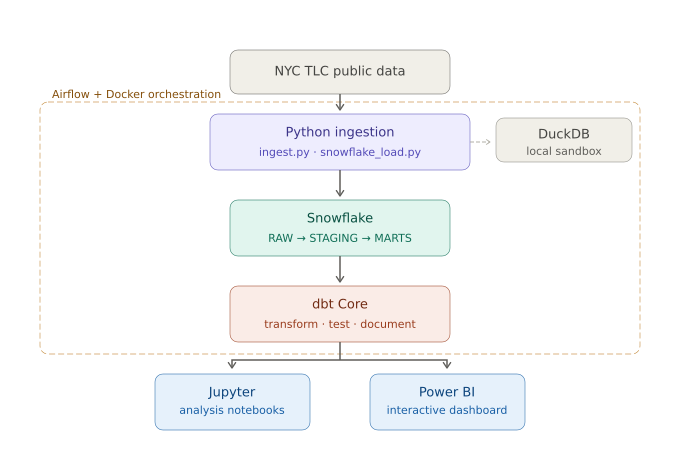
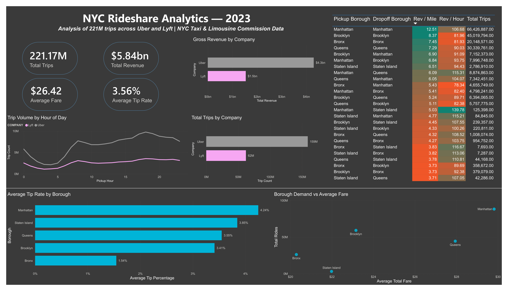
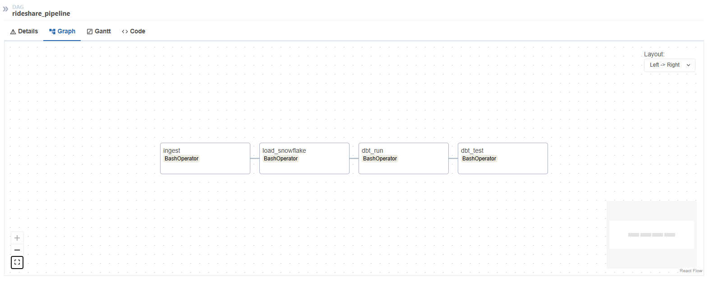

# NYC Rideshare Analytics Pipeline

*End-to-end data pipeline analyzing 221M NYC rideshare trips across Uber and Lyft*


---

## Problem Statement

NYC rideshare operators lack granular visibility into how pricing, demand, and driver economics vary across boroughs and route types — this pipeline operationalizes 221M trips of raw TLC data into actionable pricing and supply insights.

---

## Architecture



Raw NYC TLC parquet files are downloaded via Python ingestion scripts and loaded into Snowflake's RAW schema. dbt Core handles all transformation logic across two layers — STAGING (cleaned views) and MARTS (aggregated fact tables). The resulting models power both Jupyter analytical notebooks and a live-connected Power BI dashboard. The entire pipeline is orchestrated by Apache Airflow running in Docker, scheduling daily end-to-end runs from ingestion through testing.

---

## Tech Stack

| Layer | Tool | Purpose |
|---|---|---|
| Raw Data Source | NYC TLC Public Data | 221M FHVHV trip records, 2023 |
| Cloud Warehouse | Snowflake | Production data warehouse, 3-schema architecture (RAW/STAGING/MARTS) |
| Local Database | DuckDB | Local dev sandbox for data validation |
| Transformation | dbt Core | SQL transformations, testing, documentation |
| Orchestration | Apache Airflow + Docker | Automated daily pipeline scheduling |
| Analysis | Jupyter Notebooks | SQL-driven analytical narratives |
| Visualization | Power BI | Interactive dashboard with live Snowflake connection |
| Version Control | Git + GitHub | Feature branch workflow |
| Secrets | python-dotenv | Credential management |

---

## Key Findings

Analysis of 221M trips across Uber and Lyft reveals five operational insights:

**1. Uber dominates but pays drivers less**

Uber commands **73% of NYC rideshare volume** and charges a **9% fare premium** (**$27.05** vs **$24.80** avg fare), yet retains a smaller share of each fare — keeping **33.7%** vs Lyft's **31.9%** platform margin. Despite higher absolute revenue, Uber pays its drivers proportionally more per trip, making it the higher-earning platform for drivers.

**2. Brooklyn and the Bronx are systematically underpriced**

Together accounting for **37% of all trips**, Brooklyn (**$23.16** avg fare) and the Bronx (**$20.29**) sit well below the **$26.42** market average despite high demand volume. The pricing gap is not explained by shorter trips alone — it represents significant uncaptured pricing power in the outer boroughs that a demand-aware pricing model could reclaim.

**3. Revenue per mile is a misleading profitability metric**

Manhattan internal routes lead on revenue per mile (**$12.51**) but rank near the bottom on revenue per hour (**$106.68**). Manhattan→Staten Island routes generate **31% more revenue per hour** (**$139.78**) despite lower per-mile rates. Highway routes move more fare per unit of time — traditional per-mile pricing models systematically undervalue them and overvalue congested urban routes.

**4. The Bronx is the worst borough for driver earnings**

Only **7.85%** of Bronx riders tip — less than a third of Manhattan's **24% tip rate** — compounding the borough's already below-average base fares. Drivers optimizing for total compensation should factor borough tip culture into their positioning decisions, as the earnings gap between boroughs is wider than fare data alone suggests.

**5. Rideshare demand is structurally consistent, not commute-driven**

Manhattan accounts for **41% of weekday trips** and **39% of weekend trips** — a negligible shift across day type. Demand patterns hold steady seven days a week, indicating that NYC riders depend on rideshare as core transportation infrastructure rather than a commute supplement. Supply planning and surge pricing models built on a weekday/weekend split are likely miscalibrated.

---

## Dashboard



Interactive dashboard built in Power BI Desktop with live Snowflake connection, visualizing trip volume, revenue, tipping behavior, and route profitability across all NYC boroughs.

---

## Pipeline Orchestration



The pipeline is orchestrated by Apache Airflow running in Docker, triggered on a daily schedule. A single DAG executes four tasks in sequence: data ingestion → Snowflake load → dbt run → dbt test. If any task fails, the pipeline halts and retries automatically before proceeding downstream, ensuring no partial or untested data reaches the marts layer.

---

## Project Structure

```
rideshare-analytics/
├── pipeline/
│   ├── ingest.py              ← downloads raw parquet files from NYC TLC
│   ├── load.py                ← loads files into DuckDB
│   └── snowflake_load.py      ← migrates data to Snowflake
├── rideshare/                 ← dbt project
│   ├── models/
│   │   ├── staging/           ← stg_trips, stg_zones (views)
│   │   └── marts/             ← fct_trips, monthly_summary, route_profitability (tables)
│   └── macros/
├── notebooks/
│   ├── 01_exploration.ipynb   ← exploratory analysis
│   └── 02_analysis.ipynb      ← structured analytical findings
├── airflow/
│   └── dags/
│       └── rideshare_pipeline_dag.py
└── data/                      ← gitignored
```

---

## Data Model

Three mart tables serve all downstream analysis and dashboarding:

- **FCT_TRIPS** — Core fact table. 232M rows, one per trip. Enriched with borough names, time dimensions, and derived metrics (`avg_speed_mph`, `tip_percentage`, `trip_duration_minutes`). Primary key: surrogate `trip_id`.
- **MONTHLY_SUMMARY** — Aggregated by month, company, borough, and day type. KPIs: total trips, gross revenue, avg fare, avg tip rate, and driver pay metrics.
- **ROUTE_PROFITABILITY** — Aggregated by pickup/dropoff borough pair. Revenue per mile and revenue per hour for every route combination in the dataset.

---

## How to Run

### Prerequisites

- Python 3.9+
- Snowflake account
- Docker Desktop
- dbt-snowflake

### Setup

```bash
# Clone the repo
git clone https://github.com/yourusername/rideshare-analytics
cd rideshare-analytics

# Create and activate virtual environment
python -m venv venv
venv\Scripts\activate  # Windows
source venv/bin/activate  # Mac/Linux

# Install dependencies
pip install -r requirements.txt
```

### Environment Variables

Create a `.env` file in the project root:

```
SNOWFLAKE_ACCOUNT=your_account
SNOWFLAKE_USER=your_username
SNOWFLAKE_PASSWORD=your_password
SNOWFLAKE_WAREHOUSE=COMPUTE_WH
SNOWFLAKE_DATABASE=RIDESHARE
SNOWFLAKE_SCHEMA=RAW
```

### Run the Pipeline

```bash
# Download raw data
python pipeline/ingest.py

# Load to Snowflake
python pipeline/snowflake_load.py

# Run dbt transformations
cd rideshare
dbt run
dbt test
```

### Start Airflow

```bash
cd airflow
docker-compose up -d
# Access UI at http://localhost:8080
```

---

## Data Source

Raw data sourced from the [NYC Taxi & Limousine Commission](https://www.nyc.gov/site/tlc/about/tlc-trip-record-data.page) High Volume For-Hire Vehicle dataset. January–December 2023.

---

## License

MIT License
